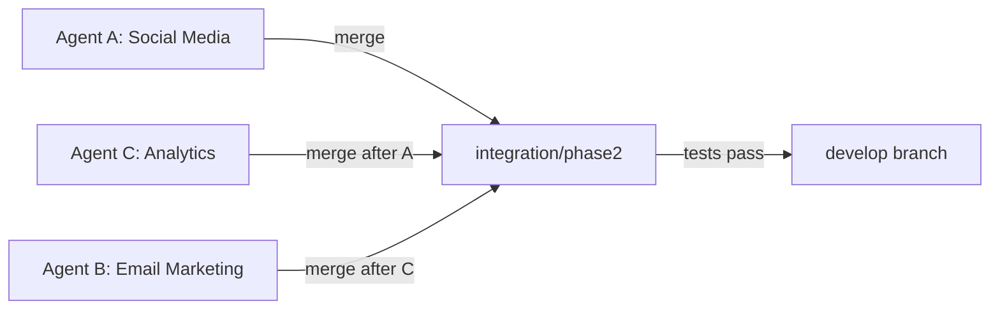

# Phase 2 Quick Start - SuperClaude Army Deployment

**Date**: 2025-11-02
**Status**: 🚀 WORKTREES CREATED - READY FOR PARALLEL EXECUTION

---

## ✅ COMPLETED

1. ✅ **Hybrid Approach Selected**: Fresh branches + existing assets
2. ✅ **Git Worktrees Created**: 3 parallel agent workspaces
3. ✅ **Session Handoff Generated**: Complete 5,500+ word guide
4. ✅ **Existing Assets Identified**: Extensive social media automation ready

---

## 📁 WORKTREE LOCATIONS

```bash
Main Repo:
/media/wolfy/.../Hub_App_Shop_Integ (main branch)

Phase 2 Agent Worktrees:
├── ../agent-workspaces/phase2-agent-a-social     [phase2/agent-a-social-v2]
├── ../agent-workspaces/phase2-agent-b-email      [phase2/agent-b-email-v2]
└── ../agent-workspaces/phase2-agent-c-analytics  [phase2/agent-c-analytics-v2]
```

---

## 🎯 AGENT MISSIONS (TL;DR)

### Agent A: Social Media Enhancement
- **Leverage**: Existing `automation/social_media/` (100% functional)
- **Add**: Advanced calendar, engagement tracker, multi-LLM content
- **Time**: 10-12 hours (sequential) → **3-4 hours (parallel)**

### Agent B: Email Marketing
- **Build**: Complete email automation system from scratch
- **Create**: 19 email templates, segmentation, triggers, A/B testing
- **Time**: 13-15 hours (sequential) → **4-5 hours (parallel)**

### Agent C: Analytics & ML
- **Enhance**: Existing dashboard with ML-powered optimization
- **Add**: Predictive analytics, funnel analysis, competitor monitoring
- **Time**: 15-18 hours (sequential) → **5-6 hours (parallel)**

---

## 🚀 LAUNCH COMMANDS

### Option 1: Manual Launch (3 VSCodium instances)

```bash
# Terminal 1 - Agent A
cd /media/wolfy/.../agent-workspaces/phase2-agent-a-social
code .  # or vscodium .

# Terminal 2 - Agent B
cd /media/wolfy/.../agent-workspaces/phase2-agent-b-email
code .

# Terminal 3 - Agent C
cd /media/wolfy/.../agent-workspaces/phase2-agent-c-analytics
code .
```

### Option 2: Automated Launch (if script exists)

```bash
cd /media/wolfy/.../Hub_App_Shop_Integ
./scripts/launch-phase2-agents.sh
```

---

## 📖 AGENT INSTRUCTIONS

Each agent should:

1. **Read**: `SESSION_HANDOFF_PHASE2_SUPERARMY_2025-11-02.md`
2. **Review**: Existing assets in their worktree
3. **Execute**: Their specific mission brief
4. **Commit**: Progress to their branch regularly
5. **Test**: All deliverables before completion

---

## 🔗 INTEGRATION PLAN



**Merge Order**: A → C → B → integration/phase2 → develop

---

## ⏱️ EXPECTED TIMELINE

**Total Time**: 15-18 hours with parallel execution
**vs Sequential**: 38-45 hours
**Time Savings**: **70%+**

---

## 📊 SUCCESS CRITERIA

✅ Agent A: Campaign automation enhanced
✅ Agent B: 19 email templates operational
✅ Agent C: ML models predicting (>80% accuracy)
✅ Integration: Zero merge conflicts
✅ Tests: All integration tests passing

---

## 📝 NEXT STEPS FOR USER

**Choose one**:

**Option A**: Launch all 3 agents now (parallel execution)
- Open 3 VSCodium windows
- Assign each window to a worktree
- Let agents work simultaneously

**Option B**: Launch agents sequentially (easier to monitor)
- Start with Agent A
- Once A complete, start Agent C
- Once C complete, start Agent B

**Option C**: Hybrid (recommended for learning)
- Start with Agent A (most existing work)
- Once A is 50% done, launch Agent C
- Once C is 50% done, launch Agent B

---

**Full Details**: See `SESSION_HANDOFF_PHASE2_SUPERARMY_2025-11-02.md`
**Quick Commands**: See above launch commands
**Status**: 🚀 READY TO DEPLOY
