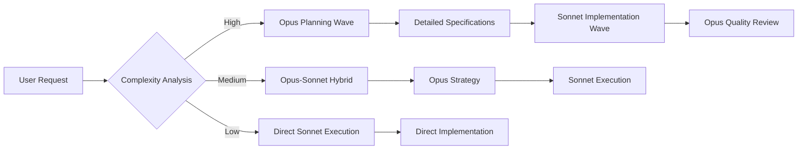

# SuperClaude Army Optimization Strategy

## Core Architecture: Opus → Sonnet Model Flow

### 🧠 **Opus as the Strategic Commander**

**Role**: Planning, Architecture, Complex Decision Making

**Optimal Use Cases**:
- **Phase Planning**: Breaking down complex projects into executable phases
- **System Architecture**: Designing component relationships and data flows
- **Strategic Decisions**: Choosing technologies, patterns, and approaches
- **Problem Analysis**: Root cause analysis and solution strategy
- **Quality Gates**: Design reviews and validation frameworks
- **Agent Coordination**: Orchestrating multi-agent workflows

**Example Opus Tasks**:
```bash
# Strategic planning and design
/analyze --think-hard --persona-architect system requirements
/design --comprehensive architecture patterns
/task --strategic project decomposition
/estimate --evidence-based complexity analysis
```

### ⚡ **Sonnet as the Execution Engine**

**Role**: Implementation, Code Generation, Repetitive Tasks

**Optimal Use Cases**:
- **Code Implementation**: Writing functions, components, and modules
- **File Operations**: Creating, editing, and managing project files
- **Template Generation**: Producing content from established patterns
- **Testing**: Writing and executing test suites
- **Documentation**: Creating implementation docs and comments
- **Deployment Tasks**: CI/CD, build processes, and infrastructure

**Example Sonnet Tasks**:
```bash
# Implementation and execution
/implement feature based on Opus design
/build components from architecture specs
/test implementation against requirements
/deploy using established procedures
```

## 🏗️ **Wave Orchestration with Model Switching**

### Phase-Based Model Assignment

**Wave 1: Strategic Planning (Opus)**
- Requirements analysis and system design
- Technology stack selection
- Architecture planning and validation
- Resource estimation and timeline
- Risk assessment and mitigation strategies

**Wave 2: Implementation Planning (Opus → Sonnet Handoff)**
- Detailed implementation specs (Opus)
- Component design and interfaces (Opus)
- Execution roadmap creation (Opus)
- **Handoff**: Specifications → Sonnet for implementation

**Wave 3: Development Execution (Sonnet)**
- Code generation and implementation
- File creation and manipulation
- Testing and validation
- Documentation generation
- Build and deployment processes

**Wave 4: Quality Assurance (Opus)**
- Code review and architecture validation
- Performance analysis and optimization
- Security assessment
- Integration testing strategy
- Production readiness evaluation

## 💰 **Cost-Performance Optimization**

### Token Economics

**Opus Costs**: ~15x more expensive than Sonnet
**Strategic Allocation**:
- **20% Opus** (Planning, Architecture, Complex Analysis)
- **80% Sonnet** (Implementation, Execution, Repetitive Tasks)

**ROI Optimization**:
```yaml
Planning Phase (Opus):
  - Cost: High per token
  - Value: Prevents rework, optimal architecture
  - ROI: 10-50x through better design decisions

Execution Phase (Sonnet):
  - Cost: Low per token
  - Value: Fast, accurate implementation
  - ROI: 5-15x through execution speed
```

### Intelligent Model Routing

**Auto-Detection Rules**:
```yaml
Route to Opus:
  - Keywords: "design", "architecture", "strategy", "analyze"
  - Complexity: >0.8
  - Decision Impact: High business impact
  - Flag Overrides: --think-hard, --ultrathink

Route to Sonnet:
  - Keywords: "implement", "build", "create", "generate"
  - Complexity: <0.7
  - Repetitive Tasks: Template-based work
  - Flag Overrides: --fast, --execute
```

## 🎭 **Persona-Model Alignment**

### Strategic Personas (Opus Preferred)
- **🏗️ Architect**: System design and long-term planning
- **🔍 Analyzer**: Root cause analysis and investigation
- **🛡️ Security**: Threat modeling and vulnerability assessment
- **📊 Performance**: Bottleneck analysis and optimization strategy

### Execution Personas (Sonnet Optimized)
- **🎨 Frontend**: UI component implementation
- **⚙️ Backend**: API and service implementation
- **🧪 QA**: Test writing and execution
- **🔧 Refactorer**: Code improvement and cleanup

### Hybrid Personas (Model Switching)
- **📚 Mentor**: Opus for complex explanations, Sonnet for examples
- **✍️ Scribe**: Opus for strategy docs, Sonnet for implementation docs

## 🚀 **Implementation Strategy**

### Configuration Updates

**Enhanced Agent Configuration**:
```yaml
agent_model_preferences:
  planning_mode:
    preferred_model: "opus"
    auto_activate: ["design", "architecture", "analyze", "strategy"]
    token_budget: "high"
    
  execution_mode:
    preferred_model: "sonnet"
    auto_activate: ["implement", "build", "create", "generate"]
    token_budget: "standard"
    
  hybrid_mode:
    model_switching: true
    decision_threshold: 0.7
    cost_optimization: true
```

**Command-Level Routing**:
```yaml
command_routing:
  opus_commands:
    - "/analyze --think-hard"
    - "/design --comprehensive"
    - "/task --strategic"
    - "/estimate --evidence-based"
    
  sonnet_commands:
    - "/implement [feature]"
    - "/build [component]"
    - "/create [template]"
    - "/generate [content]"
    
  hybrid_commands:
    - "/improve" # Opus analysis → Sonnet implementation
    - "/document" # Opus strategy → Sonnet content
```

### Wave Execution Flow

**Optimized Wave Pattern**:


## 📊 **Performance Metrics**

### Success Indicators

**Cost Efficiency**:
- Target: 60-80% cost reduction vs. Opus-only approach
- Measure: Total token cost per project completion

**Quality Maintenance**:
- Target: >95% first-time success rate
- Measure: Rework requirements and bug rates

**Speed Optimization**:
- Target: 40-60% faster delivery
- Measure: Time from request to completion

**Strategic Value**:
- Target: Better architectural decisions
- Measure: Long-term maintainability scores

### Monitoring Dashboard

**Model Usage Tracking**:
```yaml
metrics:
  opus_usage:
    - planning_tasks: "% of total"
    - strategic_decisions: "count"
    - complex_analysis: "hours"
    - cost_per_decision: "$"
    
  sonnet_usage:
    - implementation_tasks: "% of total"
    - code_generation: "lines"
    - execution_speed: "tasks/hour"
    - cost_efficiency: "$/task"
    
  hybrid_optimization:
    - handoff_success_rate: "%"
    - rework_requirements: "count"
    - overall_satisfaction: "score"
```

## 🎯 **Best Practices**

### Planning Phase (Opus)
1. **Comprehensive Upfront Design**: Invest in thorough planning to reduce execution complexity
2. **Clear Specifications**: Create detailed specs that Sonnet can execute independently
3. **Decision Documentation**: Record architectural decisions for future reference
4. **Risk Mitigation**: Identify potential issues before implementation begins

### Execution Phase (Sonnet)
1. **Template-Driven Development**: Use established patterns and templates
2. **Iterative Implementation**: Build incrementally with frequent validation
3. **Automated Testing**: Implement comprehensive test coverage
4. **Documentation**: Generate clear implementation documentation

### Quality Gates (Opus)
1. **Architecture Review**: Validate implementation against design principles
2. **Performance Analysis**: Ensure scalability and efficiency requirements
3. **Security Assessment**: Comprehensive security validation
4. **Integration Testing**: Verify system-wide functionality

## 🚀 **Advanced Optimizations**

### Context Preservation
- **Design Context**: Maintain architectural decisions across waves
- **Implementation Context**: Preserve coding patterns and conventions
- **Quality Context**: Apply consistent quality standards

### Intelligent Caching
- **Opus Decisions**: Cache strategic decisions for reuse
- **Sonnet Patterns**: Cache successful implementation patterns
- **Quality Metrics**: Track and reuse quality validation approaches

### Learning Loop
- **Success Pattern Recognition**: Identify optimal Opus→Sonnet handoff patterns
- **Failure Analysis**: Learn from suboptimal model routing decisions
- **Continuous Optimization**: Refine model selection algorithms

## 🎖️ **Competitive Advantages**

### Strategic Benefits
1. **Cost Efficiency**: 60-80% cost reduction while maintaining quality
2. **Speed Optimization**: Faster execution through appropriate model selection
3. **Quality Assurance**: Strategic oversight with efficient implementation
4. **Scalability**: Handle larger, more complex projects effectively

### Market Positioning
- **"Strategic AI": Opus for thinking, Sonnet for doing**
- **"Intelligent Resource Allocation": Right model for right task**
- **"Enterprise-Grade Efficiency": Professional project management at scale**

---

**Implementation Priority**: This optimization strategy should be the **core differentiator** of your SuperClaude Army, delivering professional-grade project management with optimal cost-performance ratios.

**Marketing Message**: *"Why choose between smart and fast? Get both - strategic intelligence from Opus, lightning execution from Sonnet."*